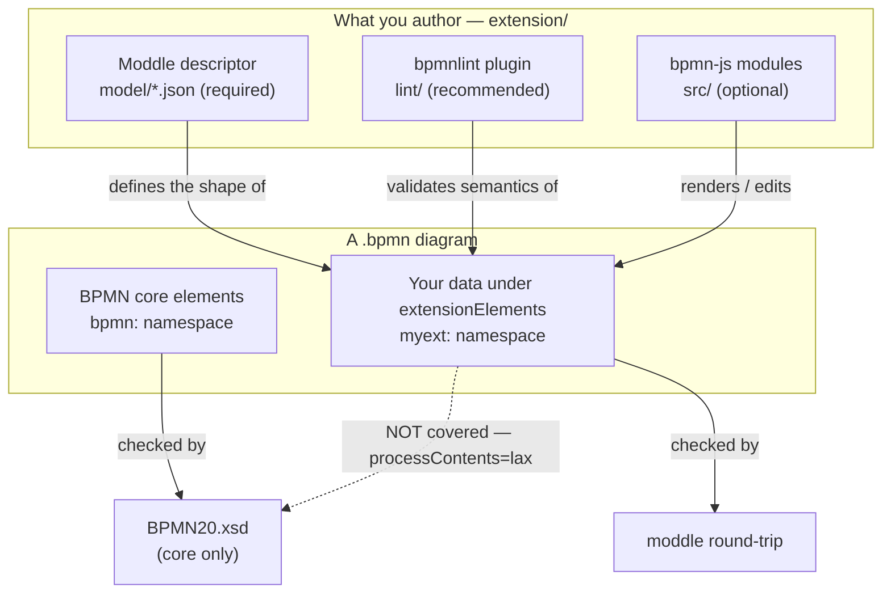

# BPMN Extension Template

A GitHub template repository for building, validating, and publishing your own
**custom BPMN 2.0 / [bpmn.io](https://bpmn.io) extension**. It ships a working
example extension, positive and negative validation fixtures, deterministic
check tools, agent skills, and CI workflows so that conformance is enforced
automatically from the first commit.

> Use this repo as a GitHub template (green **Use this template** button), then
> rename the placeholder extension (`myext` / `MyExtension`) to your own.
>
> **New to bpmn.io?** Read [`docs/concepts.md`](docs/concepts.md) first — it
> explains what a BPMN extension *is*, what each library (bpmn-js, bpmn-moddle,
> bpmnlint, diagram-js) does, and how the XSD and the moddle descriptor divide
> the work. The rest of this README assumes those terms.

**Where to start:** [`docs/concepts.md`](docs/concepts.md) (what a BPMN extension
*is* & how the libraries fit) → [Using the template](#using-the-template) (how to
build one) → [Modeling playground](#modeling-playground-demo) (see it run) →
[`extension/`](extension/) (where your code goes).

---

## Anatomy of a BPMN extension

A bpmn.io extension is made of a few independent parts. Only the first is
strictly required; the rest are added as your use case needs them.

| Part | Required? | Location | What it does |
|------|-----------|----------|--------------|
| **Moddle model descriptor** | Yes | `extension/model/*.json` | Declares the data your extension stores in the BPMN XML (a namespace, prefix, and typed properties). This is what makes your custom data readable and writable. |
| **Lint plugin** | Recommended | `extension/lint/bpmnlint-plugin-myext/` | Custom [bpmnlint](https://github.com/bpmn-io/bpmnlint) rules that enforce the *semantics* of your data — constraints the XSD cannot express. |
| **bpmn-js modules** | Optional | `extension/src/` | Editor/viewer behaviour: custom renderer, palette entries, context-pad actions, modeling rules, properties-panel groups. Injected via `additionalModules`. Ships a sample properties-panel provider you can run in the [demo](#modeling-playground-demo). |
| **Examples** | Recommended | `examples/` | Abstract diagrams that exercise the extension, used as test fixtures. |

### How the pieces fit together

Your three authored parts each teach a different layer of the toolchain about
your data, and the validation tools each cover a different slice of the file.
The crux: the **moddle descriptor** defines the *shape* of your data, the
**lint plugin** enforces its *semantics*, and the **BPMN20.xsd never touches it
at all** (it validates the `bpmn:` core only). For the per-library background
behind this picture, see [`docs/concepts.md`](docs/concepts.md).



### How the data lives in the XML

Custom data is attached under the standard `bpmn:extensionElements` of any
element, in **your own namespace** — never the `bpmn:` namespace. The example
descriptor defines an `Annotation` element with a `category` attribute and
nested `note` children:

```xml
<bpmn:task id="Task_1" name="Reviewed task">
  <bpmn:extensionElements>
    <myext:annotation category="quality" reviewed="true">
      <myext:note author="example">Looks good.</myext:note>
    </myext:annotation>
  </bpmn:extensionElements>
</bpmn:task>
```

The matching moddle descriptor (`extension/model/myExtension.json`):

```json
{
  "name": "MyExtension",
  "uri": "http://example.com/schema/my-extension/1.0",
  "prefix": "myext",
  "types": [
    {
      "name": "Annotation",
      "superClass": ["Element"],
      "properties": [
        { "name": "category", "type": "String", "isAttr": true },
        { "name": "reviewed", "type": "Boolean", "isAttr": true, "default": false },
        { "name": "note", "type": "Note", "isMany": true }
      ]
    }
  ]
}
```

Key descriptor conventions: types that hang off `extensionElements` use
`"superClass": ["Element"]`; XML attributes use `"isAttr": true`; repeatable
children use `"isMany": true`; element text uses `"isBody": true`.

---

## Repository layout

```
.
├── AGENTS.md                  # canonical agent context (read by 30+ tools)
├── CLAUDE.md                  # imports AGENTS.md
├── CONTRIBUTING.md            # dev workflow + Conventional Commits + releases
├── LICENSE                    # MIT
├── .bpmnlintrc                # lint config: recommended + your plugin + moddle ext
├── package.json               # validation scripts + conventions
├── release-please-config.json # SemVer release automation (Release Please v4)
├── .release-please-manifest.json
├── docs/
│   ├── concepts.md            # primer: what an extension is + how the libs fit
│   └── adr/                   # architecture decision records (TEMPLATE.md)
├── extension/                 # >>> YOUR extension goes here <<<
│   ├── model/
│   │   ├── myExtension.json    # moddle descriptor (rename me) — source of truth
│   │   └── myExtension.xsd     # generated from the descriptor (npm run xsd:gen)
│   ├── lint/
│   │   └── bpmnlint-plugin-myext/
│   │       ├── index.js
│   │       └── rules/annotation-requires-category.js
│   └── src/                    # optional bpmn-js modules
│       ├── index.js            # the additionalModules entry
│       └── MyExtPropertiesProvider.js  # sample properties-panel group
├── demo/                       # interactive modeler playground (private, not published)
│   ├── index.html
│   ├── vite.config.js          # base path comes from $BASE_PATH (for Pages)
│   └── src/main.js             # Modeler wired to the descriptor + src module
├── examples/
│   ├── valid/                  # positive fixtures — must pass lint
│   └── invalid/                # negative fixtures — must fail lint
├── tools/
│   ├── validate-xsd.sh         # BPMN-core XSD validation (xmllint)
│   ├── moddle-roundtrip.mjs    # fromXML -> toXML with extension registered
│   ├── moddle-to-xsd.mjs       # generate extension XSD from the descriptor
│   ├── validate-xsd-ext.mjs    # validate examples vs BPMN core + extension XSD
│   └── check-package-conventions.mjs
├── skills/                     # agent skills (vendor-neutral)
│   ├── bpmn-conformance/
│   ├── moddle-extension-review/
│   ├── bpmn-naming-publishing/
│   └── architecture-review/
├── .devcontainer/             # reproducible dev env / Codespaces (modeler preinstalled)
└── .github/workflows/
    ├── validate.yml            # runs all checks on push / PR
    ├── pages.yml               # builds demo/ → GitHub Pages
    └── release-please.yml      # SemVer release PR + npm publish on merge
```

---

## Using the template

1. **Create your repo** from this template and clone it.
2. **Install dependencies:** `npm install` (Node 22+; an `engines` field enforces
   this). It also pulls the bpmn-js UI stack and Vite via the `demo/` workspace —
   that is expected, not bloat (the published package ships only `extension/`).
3. **Rename the placeholder** everywhere: `myext` → your prefix,
   `MyExtension` → your name, and rename
   `extension/lint/bpmnlint-plugin-myext/` accordingly. Set a stable, owned
   `uri` in the descriptor.
4. **Model your data** in `extension/model/<your>.json`.
5. **Write rules** in the lint plugin for any constraint the XSD cannot check.
6. **Add fixtures:** a positive diagram in `examples/valid/` and a deliberately
   broken one in `examples/invalid/` for every rule you add.
7. **Run the full check:** `npm run validate`.
8. *(Optional)* add bpmn-js modules under `extension/src/` for editor behaviour.
9. *(Optional)* `npm run xsd:gen` to emit `extension/model/<name>.xsd` for
   XSD-native consumers, and `npm run xsd:ext` to validate the examples against
   BPMN core **and** that extension XSD.

---

## Modeling playground (demo)

`demo/` is an interactive bpmn-js modeler for trying the extension **by hand**:
open a diagram, select the task, edit the `Annotation (myext)` group in the
properties panel, and download the XML to see your custom data. It wires the
**real** descriptor (`moddleExtensions` — the *data* layer) and the sample
`extension/src/` module (`additionalModules` — the *UI* layer), so it exercises
your actual artifacts, not copies. See [`docs/concepts.md`](docs/concepts.md) for
what each slot does.

```bash
npm install     # installs the demo too (it is a workspace)
npm run demo    # vite dev server → http://localhost:5173
```

Three surfaces, one `demo/` build:

| Surface | How | Good for |
|---------|-----|----------|
| **Local** | `npm run demo` | day-to-day authoring |
| **Dev container / Codespaces** | open in a container — `.devcontainer/` installs deps and auto-starts the modeler on a forwarded port | zero-setup contribution / live walkthrough |
| **GitHub Pages** | `.github/workflows/pages.yml` builds `demo/` and publishes a static site; enable **Settings → Pages → Source: GitHub Actions** | a permanent public "try it" link |

The playground is a **private, non-published** workspace (excluded from the npm
package) and is **not** a pass/fail gate — the deterministic checks remain the
source of truth. Its bundle is public when deployed, so keep only
abstract/synthetic diagrams in `examples/`.

---

## Validation pipeline

| Stage | Command | What it proves |
|-------|---------|----------------|
| Lint (positive) | `npm run lint:valid` | Valid diagrams satisfy `bpmnlint:recommended` + your rules. |
| Lint (negative) | `npm run lint:invalid` | Broken diagrams **are** rejected — proves your rules fire. CI inverts the exit code. |
| Round-trip | `npm run roundtrip` | Custom extension data parses and serialises through `bpmn-moddle` without warnings or loss. |
| XSD core | `npm run xsd` | The standard BPMN structure validates against the official `BPMN20.xsd`. |
| Conventions | `npm run conventions` | `package.json` follows bpmn.io naming/publishing rules. |
| XSD extension *(opt-in)* | `npm run xsd:ext` | Example diagrams validate against `BPMN20.xsd` **and** a generated extension XSD — the **structure** of your custom data. |

`npm run validate` chains the common subset. `xsd:ext` is **not** in that chain
(it needs the generated XSD and only checks structure); run it on its own when
you want XSD-level validation of the extension data.

> **Important scope boundary.** Out of the box the XSD step validates the **BPMN
> core only**. Elements under `<extensionElements>` are parsed with
> `processContents="lax"`, so a stock validator does **not** check your custom
> data, and there is no official, freely runnable OMG conformance CLI. Your
> extension's correctness is established by the **round-trip** and the **lint
> plugin** — never read "XSD core passed" as "extension valid".
>
> **Optional extension XSD.** If you (or your consumers) want XSD-native
> validation of the custom data too, `npm run xsd:gen` derives an XSD from the
> moddle descriptor (`extension/model/<name>.xsd`) and `npm run xsd:ext`
> validates the examples against `BPMN20.xsd` + that XSD in one pass (via a
> driver schema; `BPMN20.xsd` is never patched). It is **generated from the
> descriptor** — the single source of truth — so the two cannot drift, and a
> built-in self-check fails loudly if the `lax` wildcard ever skips your schema.
> It still only covers **structure**; required attributes and cross-element
> rules stay in the lint plugin. See [`docs/concepts.md`](docs/concepts.md).

The tools are the source of truth: the pass/fail decision is deterministic and
made by `bpmnlint`, `bpmn-moddle`, and `xmllint` — not by a language model. The
agent skills only orchestrate and explain them, which keeps the workflow
reliable and independent of any particular agent or model.

---

## Continuous integration

- **`validate.yml`** runs on every push to `main` and every pull request:
  installs deps and `xmllint`, then runs the positive lint, the negative lint
  (asserting failure), the round-trip, the XSD core check, the extension-XSD
  drift guard (`xsd:gen:check`) and dual conformance (`xsd:ext`), and the
  conventions check.
- **`pages.yml`** builds the `demo/` playground (`vite build`) and deploys it to
  GitHub Pages on every push to `main`. Enable it once under
  **Settings → Pages → Source: GitHub Actions**; it is independent of the
  validation and release workflows.
- **`release-please.yml`** runs on every push to `main`: it maintains a release
  PR from your Conventional Commits and, once that PR is merged, tags the
  release and publishes to npm with provenance. Add an `NPM_TOKEN` secret first.

---

## Versioning & publishing

Versioning follows [SemVer](https://semver.org/) and is automated by
[Release Please](https://github.com/googleapis/release-please) (manifest config
in `release-please-config.json` + `.release-please-manifest.json`). You do not
bump versions by hand — your **commit types** drive the next version:

| Commit | Release effect |
|--------|----------------|
| `fix:` | PATCH |
| `feat:` | MINOR |
| `feat!:` / `BREAKING CHANGE:` | MAJOR (MINOR while pre-1.0) |

The flow: merge Conventional Commits → Release Please opens a release PR
(bumping `package.json` + manifest, writing `CHANGELOG.md`) → merge it → the
release is tagged and published. See [`CONTRIBUTING.md`](CONTRIBUTING.md) for
the commit convention and the rationale behind in-workflow publishing.

One release bumps **all** of the extension's artifacts to the same version — via
`extra-files` in `release-please-config.json` it updates the lint-plugin
`package.json`, the moddle descriptor's `version`, and the generated XSD,
alongside the root `package.json`. The namespace `uri` (`…/1.0`) is **not**
bumped: it is the *data-format contract* version, changed by hand only when you
intentionally break the format. See
[ADR-0001](docs/adr/0001-versioning-and-release-please.md).

Follow bpmn.io naming conventions so the ecosystem can discover your package
(enforced by `npm run conventions`):

- bpmn-js modules: name starts with **`bpmn-js-`**.
- lint plugins: name starts with **`bpmnlint-plugin-`**.
- Declare `bpmn-js` / `diagram-js` as **`peerDependencies`**, never hard deps.
- If `extension/src/` uses the properties panel, also declare
  `@bpmn-io/properties-panel` and `bpmn-js-properties-panel` as **optional**
  peers (this template's `package.json` shows the pattern).
- Ship **ES modules** (`"type": "module"`), set a `license`.

---

## Agent skills

The `skills/` directory contains portable `SKILL.md` capabilities that work
across compatible coding agents (Claude Code, Codex, Cursor, and others). Each
skill wraps the deterministic tools above:

- **bpmn-conformance** — run the full conformance pipeline and report per stage.
- **moddle-extension-review** — review a model descriptor for structure and namespace hygiene.
- **bpmn-naming-publishing** — check packaging/naming before release.
- **architecture-review** — multi-axis code & architecture review (correctness, readability, architecture, security, performance), vendored from [addyosmani/agent-skills](https://github.com/addyosmani/agent-skills) (MIT).

`AGENTS.md` is the single source of project context; `CLAUDE.md` imports it (and
other agents — Cursor, Codex — can be pointed at the same file), so you maintain
guidance once.

---

## License

MIT. Replace the placeholder in `LICENSE` with your name and year.
