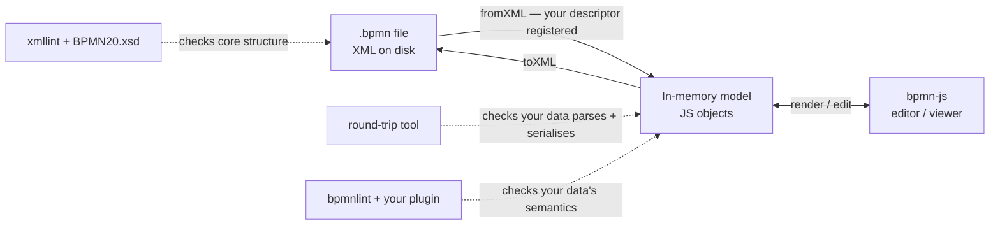

# Concepts — what a BPMN extension is and how the pieces fit together

A primer for anyone new to the [bpmn.io](https://bpmn.io) stack. If you already
know bpmn-js and bpmn-moddle, the root [`README.md`](../README.md) is enough —
start there. This page fills in the background the README assumes.

---

## 1. Why extensions exist

[BPMN 2.0](https://www.omg.org/spec/BPMN/2.0.2/) is an OMG standard with a fixed
vocabulary: tasks, events, gateways, sequence flows, lanes, and so on. That
vocabulary is deliberately closed — a `bpmn:task` means the same thing
everywhere, which is what makes diagrams portable between tools.

But real projects need to attach data the standard never anticipated: a review
status, a clinical code, a cost estimate, an SLA. BPMN 2.0 plans for exactly
this with an **extension mechanism**. Every BPMN element can carry a
`<bpmn:extensionElements>` container, and inside it you may place **any
well-formed XML in your own namespace**:

```xml
<bpmn:task id="Task_1" name="Reviewed task">
  <bpmn:extensionElements>
    <myext:annotation category="quality" reviewed="true">
      <myext:note author="example">Looks good.</myext:note>
    </myext:annotation>
  </bpmn:extensionElements>
</bpmn:task>
```

Two rules make this safe:

- **Your data lives in your own namespace** (`myext:`, bound to a URI you own) —
  never under `bpmn:`. A tool that doesn't know your extension simply ignores
  the foreign-namespace content and the rest of the diagram still works.
- **The standard XSD does not police your data.** The schema declares
  `extensionElements` with `processContents="lax"`, which tells an XML validator
  "validate this child only if you happen to have its schema; otherwise accept
  it." So a stock BPMN validator will *never* reject — or check — your custom
  content. Establishing that your data is correct is *your* job, and that is
  what this template automates.

A "BPMN extension" in the bpmn.io sense is therefore the bundle of artifacts
that **define, validate, and (optionally) edit** that namespaced data.

### What the OMG spec says about this

The OMG BPMN 2.0 specification builds this escape hatch in deliberately (its
*Extensibility* section, 8.2.3). Two consequences matter here.

**A formal extension model, but no required XSD.** The spec defines four
meta-model classes for describing extension data — `Extension`,
`ExtensionDefinition`, `ExtensionAttributeDefinition`, and
`ExtensionAttributeValue` — but that description is *not* an XML Schema, and the
spec does not require you to publish one. In the interchange schema the
container is declared to accept anything from a foreign namespace, **unchecked**:

```xml
<!-- BPMN 2.0 Semantic.xsd -->
<xsd:complexType name="tExtensionElements">
  <xsd:sequence>
    <xsd:any namespace="##other" processContents="lax"
             minOccurs="0" maxOccurs="unbounded"/>
  </xsd:sequence>
</xsd:complexType>
```

`tBaseElement` likewise permits `<xsd:anyAttribute namespace="##other"
processContents="lax"/>`. `##other` means "any namespace except BPMN's own";
`processContents="lax"` means "validate against a schema **only if** the
processor already has one, otherwise accept without error." So a standard BPMN
validator neither needs nor checks a schema for your extension — which is
precisely **why no XSD is required** for a custom extension.

**Conformance treats extensions as optional and non-binding.** A conformant
tool *may ignore* any extension — the `Extension` class's `mustUnderstand` flag
defaults to `false` — and an extension *must not contradict the semantics of any
BPMN element*; it may add data, never redefine the standard. The OMG publishes
the XSDs but **no normative conformance test suite or CLI** that validates
extension content: establishing that correctness is the extension author's job.
In this template that job is done by the **moddle round-trip** and the
**bpmnlint plugin**, exactly as Section 3 describes.

---

## 2. The bpmn.io toolchain — who does what

The bpmn.io project is a family of small, composable libraries. You rarely touch
all of them, but it helps to know the layers:

| Library | Layer | Role | Where it appears in this repo |
|---------|-------|------|-------------------------------|
| **[diagram-js](https://github.com/bpmn-io/diagram-js)** | foundation | Generic diagram rendering & interaction engine (shapes, canvas, events). BPMN-agnostic. | A `peerDependency`; only relevant once you add editor behaviour in `extension/src/`. |
| **[bpmn-js](https://github.com/bpmn-io/bpmn-js)** | editor/viewer | The BPMN modeler/viewer built on diagram-js. Renders a `.bpmn` file as an editable diagram. | A `peerDependency`; your optional `extension/src/` modules plug into it via `additionalModules`. |
| **[moddle](https://github.com/bpmn-io/moddle)** | meta-model | A library for describing a data model in JSON and mapping it to/from objects. The generic engine. | Indirect — the engine underneath bpmn-moddle. |
| **[bpmn-moddle](https://github.com/bpmn-io/bpmn-moddle)** | meta-model (BPMN) | moddle pre-loaded with the BPMN 2.0 model. Reads BPMN XML into JS objects (`fromXML`) and writes them back (`toXML`). Accepts **extra descriptors** so it understands *your* namespace too. | `tools/moddle-roundtrip.mjs` registers your descriptor and round-trips every example. |
| **[bpmnlint](https://github.com/bpmn-io/bpmnlint)** | linter | Rule engine that walks the parsed model and reports violations. Ships `recommended` rules; accepts custom **plugins** and **moddleExtensions**. | `extension/lint/bpmnlint-plugin-myext/` + `.bpmnlintrc`. |
| **[properties-panel](https://github.com/bpmn-io/properties-panel)** + **[bpmn-js-properties-panel](https://github.com/bpmn-io/bpmn-js-properties-panel)** | editor UI | The properties-panel framework (form entries) and its bpmn-js integration — where custom form controls for your data live. | **Optional** peer deps; the sample `extension/src/MyExtPropertiesProvider.js` uses them, exercised in `demo/`. |

The key idea: **bpmn-moddle is the read/write layer, bpmn-js is the UI layer, and
bpmnlint is the rules layer.** Your extension teaches each of them about your
data — but only the read/write layer (the moddle descriptor) is mandatory.

---

## 3. Two schemas, two scopes — XSD vs. the moddle descriptor

The single most common point of confusion is the relationship between the
**BPMN20.xsd** and your **moddle descriptor**. They are both "schemas," but they
cover *different parts of the file*:

- **`BPMN20.xsd`** is the official XML Schema for the BPMN **core** — `bpmn:`
  elements only. The template runs it via `xmllint` (`npm run xsd`) to prove
  your example diagrams are structurally valid BPMN. Because of
  `processContents="lax"`, it stops at the boundary of `extensionElements`.
- **The moddle descriptor** (`extension/model/myExtension.json`) is effectively
  *the schema for your extension data*. It declares your namespace, prefix, and
  the typed shape of each custom element (which attributes, which child
  elements, which are repeatable). bpmn-moddle uses it to parse and serialise
  your data; bpmnlint uses it to recognise your types.

So the two schemas are complementary, not competing:

> **XSD ⇒ "is the BPMN core well-formed?" · moddle descriptor ⇒ "is my custom
> data well-shaped?"** Neither one validates the other's territory. "XSD passed"
> never means "the extension is valid."

What about *semantic* constraints the moddle descriptor can't express — e.g.
"every annotation **must** have a category"? Shape is structural; "must" is a
rule. Those go in the **bpmnlint plugin**. That is the whole reason the plugin
exists.

### Optional: an extension XSD for XSD-native consumers

You don't *need* an XSD for your extension (Section 1 explains why — `lax`). But
you can generate one, and sometimes it's worth it:

- **Worth it when** consumers validate BPMN with XML-Schema tooling (Java/.NET/
  `lxml`/`xmllint`, an ESB, a document-validation gate) and aren't running the
  bpmn.io/JS stack, or when you want a stricter structural gate than moddle's
  permissive parse (moddle tolerates typo'd attributes and wrong cardinality; an
  XSD rejects them), or simply a formal, language-agnostic contract to publish.
- **Skip it when** the consumers are all bpmn.io-based — the moddle descriptor
  plus round-trip already cover them, and a second hand-maintained schema would
  just drift.

This template takes the safe path: `npm run xsd:gen` **derives** the XSD from
the moddle descriptor (`tools/moddle-to-xsd.mjs`), so the descriptor stays the
single source of truth and the two cannot diverge (CI fails on drift). Then
`npm run xsd:ext` validates the examples against `BPMN20.xsd` **and** the
generated XSD together, using a small *driver schema* that imports both — the
stock `BPMN20.xsd` is never modified. Because `extensionElements` is `lax`, the
extension schema is consulted only when the validator actually holds it, so the
runner includes a self-check that deliberately feeds a malformed element and
fails if it sneaks through. Even then the XSD covers **structure only** — the
semantic rules stay in the lint plugin.

---

## 4. How it all fits together at runtime

When a `.bpmn` file is loaded, edited, and saved, the data flows like this — and
each validation tool inspects a different stage:



- **bpmn-moddle** turns XML into objects and back. With your descriptor
  registered, your `myext:` data survives the trip; without it, the data would
  be dropped on save. The **round-trip tool** asserts exactly this.
- **bpmn-js** (optional) lets a human render and edit those objects. Your
  `extension/src/` modules decide how your data is shown and changed.
- **bpmnlint** runs your rules over the parsed objects to enforce semantics.
- **xmllint + BPMN20.xsd** independently confirm the surrounding BPMN core is
  standard-conformant.

The deterministic tools — not any reading of the diagram — make the pass/fail
call. See [`README.md`](../README.md) for the exact commands and the CI wiring.

### Wiring it into a modeler — `moddleExtensions` vs `additionalModules`

A consumer plugs your extension into a bpmn-js `Modeler` (or `Viewer`) through
two separate slots, and the distinction *is* the mental model:

- **`moddleExtensions: { myext: <descriptor> }`** — the **data layer**. Registers
  your moddle descriptor so bpmn-moddle can read and write your `myext:` data.
  **Required**: without it, your custom data is silently dropped the next time
  the diagram is saved.
- **`additionalModules: [ myExtModule ]`** — the **UI layer**. Injects your
  optional `extension/src/` bpmn-js module (the properties-panel group, a custom
  renderer, palette entries, …). **Optional**: it only changes the editing
  experience; the data is valid and round-trips with or without it.

So the descriptor goes in one slot (so the data is *understood*) and
`extension/src/index.js` in the other (so the data is *editable*). The
[`demo/`](../demo/) playground is a runnable instance of the diagram above: it
constructs a `Modeler` with **both** slots wired to the real `extension/`
artifacts, so you can watch your data flow from XML → objects → editor and back.
See [`demo/README.md`](../demo/README.md).

---

## 5. Glossary

| Term | Meaning |
|------|---------|
| **BPMN 2.0** | The OMG Business Process Model and Notation standard; the closed core vocabulary and the XML serialisation your diagrams use. |
| **bpmn.io** | The open-source project (by Camunda) providing bpmn-js, bpmn-moddle, bpmnlint, diagram-js, and friends. |
| **diagram-js** | The generic, BPMN-agnostic diagramming engine bpmn-js is built on. |
| **bpmn-js** | The BPMN modeler/viewer — the thing that draws and edits the diagram. |
| **moddle** | A library for defining a data model in JSON and binding it to objects. |
| **bpmn-moddle** | moddle loaded with the BPMN model; reads/writes BPMN XML (`fromXML` / `toXML`) and accepts your extension descriptor. |
| **moddle descriptor** | The JSON file (`extension/model/*.json`) that declares your namespace, prefix, and typed element shapes. The required core of an extension. |
| **descriptor type** | One entry in the descriptor's `types` array — a custom element (e.g. `Annotation`) with its `properties`. |
| **`superClass: ["Element"]`** | Marks a descriptor type as something that can live under `extensionElements`. |
| **`isAttr` / `isMany` / `isBody`** | Property flags: XML attribute / repeatable child element / element text content. |
| **bpmnlint** | The BPMN linter; runs `recommended` plus your plugin's rules over the parsed model. |
| **lint plugin** | A package (`bpmnlint-plugin-*`) of custom rules enforcing semantics the descriptor and XSD cannot express. |
| **`extensionElements`** | The standard BPMN container under any element that holds foreign-namespace custom data. |
| **namespace / prefix / URI** | Your data lives in its own XML namespace, identified by a stable URI you own and referenced via a short prefix (here `myext`). |
| **`processContents="lax"`** | The XSD setting on `extensionElements` that makes a validator skip (rather than reject) content it has no schema for — why the XSD never checks your data. |
| **round-trip** | Parsing XML to objects and serialising back; proves your data is understood and lossless. |
| **XSD (BPMN20.xsd)** | The official XML Schema for the BPMN core; validates `bpmn:` structure only. |
| **DI / `bpmndi` / `dc` / `di`** | Diagram Interchange — the standard namespaces that store shape positions and waypoints (the visual layout), separate from the semantic model. |

---

## 6. Further reading

**Building a bpmn.io extension — the canonical examples:**

- [bpmn-js-examples](https://github.com/bpmn-io/bpmn-js-examples) — the official
  example collection. The ones that map directly onto this template:
  - [custom-meta-model](https://github.com/bpmn-io/bpmn-js-examples/tree/main/custom-meta-model) — defining a moddle model extension (the descriptor side).
  - [properties-panel-extension](https://github.com/bpmn-io/bpmn-js-examples/tree/main/properties-panel-extension) — adding a custom properties-panel group (the pattern `extension/src/MyExtPropertiesProvider.js` follows).
  - [custom-elements](https://github.com/bpmn-io/bpmn-js-examples/tree/main/custom-elements) and [custom-modeling-rules](https://github.com/bpmn-io/bpmn-js-examples/tree/main/custom-modeling-rules) — custom rendering and modeling rules for `extension/src/`.
- [bpmnlint-plugin-example](https://github.com/bpmn-io/bpmnlint-plugin-example) — how to define, test, and consume custom lint rules (scaffold one with `npm init bpmnlint-plugin`).

**The libraries (APIs & sources):**

- [bpmn-js](https://github.com/bpmn-io/bpmn-js) · [diagram-js](https://github.com/bpmn-io/diagram-js) · [bpmn-moddle](https://github.com/bpmn-io/bpmn-moddle) · [moddle](https://github.com/bpmn-io/moddle)
- [@bpmn-io/properties-panel](https://github.com/bpmn-io/properties-panel) · [bpmn-js-properties-panel](https://github.com/bpmn-io/bpmn-js-properties-panel) · [bpmnlint](https://github.com/bpmn-io/bpmnlint)

**The standard:**

- [BPMN 2.0.2 specification (OMG)](https://www.omg.org/spec/BPMN/2.0.2/) — the extensibility mechanism is §8.2.3 (see [Section 1](#1-why-extensions-exist)).

---

New to the workflow next? Go back to [`README.md`](../README.md) →
**Using the template**.
